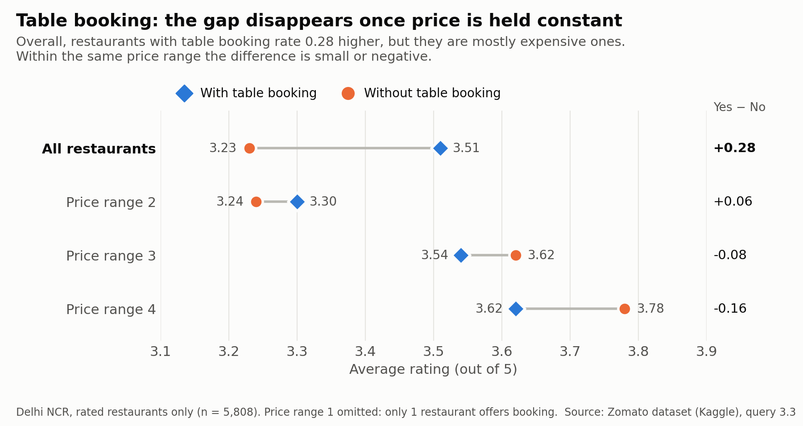
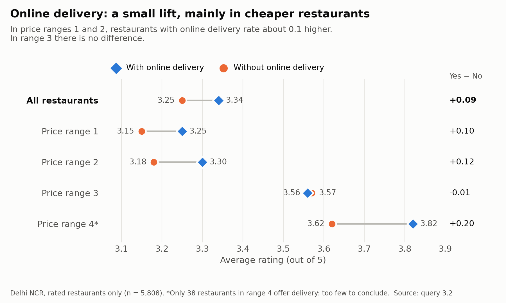

# What Drives Restaurant Ratings? A SQL Market Analysis

*PostgreSQL analysis of 9,551 restaurants from the Zomato dataset: data cleaning, a sampling-bias check, and the factors linked to higher ratings.*

**Business question:** What separates highly rated restaurants from the rest: price level, online delivery, table booking, or cuisine?

**Tools:** PostgreSQL, pgAdmin
**Dataset:** [Zomato Market Analysis](https://www.kaggle.com/datasets/srisyra02/zomato-market-analysis) by Srimathy Sivanessan (Kaggle): 9,551 restaurants, 141 cities, 15 countries
**SQL techniques:** data-quality checks, views, CTEs, window functions (`RANK`, `SUM() OVER`), `CASE` segmentation, `FILTER`, `UNNEST` / `STRING_TO_ARRAY`, `CORR`

---

## Project structure

| File | Content |
|---|---|
| `restaurant_rating_drivers.sql` | Full script: table creation, data load, quality checks, analysis |
| `README.md` | Project summary and key findings |
| `images/` | Charts built from the results of queries 3.2 and 3.3 |
| `data/` | Original dataset (CSV), included unmodified |

The script is organised in five parts:

0. **Setup**: table, CSV import, country lookup table
1. **Data quality checks**: missing values, "Not rated" rows, currencies, chains, sampling
2. **Exploratory analysis**: cities, cuisines, average rating, cost per price range
3. **What drives a high rating?**: price, online delivery, table booking, cuisine, correlations
4. **Rankings and segments**: top restaurants, best per city, popularity segments, chains

---

## Data cleaning decisions

Three problems in the raw data would have produced wrong results if ignored:

**1. A rating of 0 means "Not rated", not a bad rating.**
2,148 restaurants (22%) have `aggregate_rating = 0`. Including them pulls the average rating down from **3.44 to 2.67**. All rating analysis uses the view `v_rated`, which excludes them.

**2. The dataset is not an equal sample across cities.**

| Region | Restaurants | Cities | Per city | Not rated | Avg rating |
|---|---|---|---|---|---|
| Delhi NCR | 7,947 | 5 | ~1,590 | 26.9% | 3.28 |
| Rest of India | 705 | 38 | ~19 | 0.0% | 3.94 |
| Outside India | 899 | 98 | ~9 | 1.0% | 4.08 |

Delhi NCR (New Delhi, Gurgaon, Noida, Faridabad, Ghaziabad) is fully covered. Other cities hold only a small set of mostly top-rated restaurants, so ranking cities or countries by rating would be misleading. **Rating drivers are therefore analysed on Delhi NCR only** (view `v_ncr`, 5,808 rated restaurants).

**3. Other issues handled:**
- `cuisines` is a comma-separated list ("North Indian, Chinese"). It is split with `UNNEST(STRING_TO_ARRAY(...))` before counting, otherwise combinations are counted instead of cuisines.
- Costs come in 12 currencies, so `average_cost_for_two` is only compared within a country.
- Restaurant names repeat 2,105 times because of chains (e.g. Domino's has 74 outlets), so counts use `restaurant_id`.
- `switch_to_order_menu` is "No" for every row and `is_delivering_now` is "Yes" for only 34 rows. Both are excluded as uninformative.
- Known source errors are left as-is and noted: Philippine restaurants are labelled with the currency "Botswana Pula", and the pound sign is badly encoded.

---

## Key findings (Delhi NCR, rated restaurants)

**1. Popularity is the strongest signal.**
Highly popular restaurants (>1,000 votes) average **4.00**, compared with **3.14** for those under 100 votes. Correlation between rating and log(votes) is **0.57**, the strongest of all tested variables. This cuts both ways: good restaurants attract more reviews, and more reviews stabilise the rating.

**2. Higher price goes with higher rating, but the effect is moderate.**
Average rating rises from **3.18** (price range 1) to **3.65** (price range 4). Correlation is **0.30**.

**3. Table booking does not explain ratings once price is controlled for.**
Overall, restaurants with table booking look better (3.51 vs 3.23). Within the same price range, though, the difference disappears or reverses. In price range 3 it is 3.54 with booking vs 3.62 without. The apparent effect comes from table booking being common in expensive restaurants.

**4. Online delivery has a small positive association in the cheaper segments.**
In price ranges 1 and 2, restaurants with online delivery rate about **0.10 higher** (e.g. 3.30 vs 3.18 in range 2). In range 3 there is no difference. Range 4 shows a larger gap (3.82 vs 3.62), but only 38 restaurants there offer delivery, which is too few to draw a conclusion.

**5. Cuisine matters.**
Best rated: Asian (3.80), European (3.79), Mediterranean (3.78). Lowest: Raw Meats (3.07), Pizza, Mithai and South Indian (3.14 each). Chinese is the second most common cuisine but rates below average (3.20).

**6. Big chains rate below average (all regions, chains with 10+ rated outlets).**
Domino's (2.93), Cafe Coffee Day (3.00) and Subway (3.00) are the three largest chains and all sit below the 3.44 overall average. Barbeque Nation is the exception at **4.35** across 26 outlets.

**Profile of an above-average restaurant vs. the rest:**

| | Above average | At or below average |
|---|---|---|
| Restaurants | 2,915 | 2,893 |
| Avg price range | 2.03 | 1.57 |
| Table booking | 24.7% | 9.7% |
| Online delivery | 46.9% | 29.7% |
| Avg votes | 250 | 38 |

---

## Limitations

- All findings are **associations, not causes**. The data cannot show that adding online delivery would raise a restaurant's rating.
- Results for Delhi NCR should not be generalised to the other cities in the dataset, because of the sampling issue described above.
- The dataset is a snapshot. Its collection date is not stated.

---

## Data source & license

- **Dataset:** [Zomato Market Analysis](https://www.kaggle.com/datasets/srisyra02/zomato-market-analysis) by Srimathy Sivanessan, Kaggle
- **License:** [CC BY-NC-SA 4.0](https://creativecommons.org/licenses/by-nc-sa/4.0/)
- The file `data/Zomato_Restaurant_Dataset.csv` is included unmodified for reproducibility. All cleaning is done in SQL (see Part 1 of the script).

---

## How to run

1. Use the CSV in `data/` (or download it from Kaggle).
2. Open `restaurant_rating_drivers.sql` in pgAdmin (or psql).
3. In the `COPY` statement, replace `/path/to/Zomato_Restaurant_Dataset.csv` with your local path. Alternatively, import the file through pgAdmin's *Import/Export Data* after creating the table.
4. Run the script top to bottom. It was tested on PostgreSQL 16.
